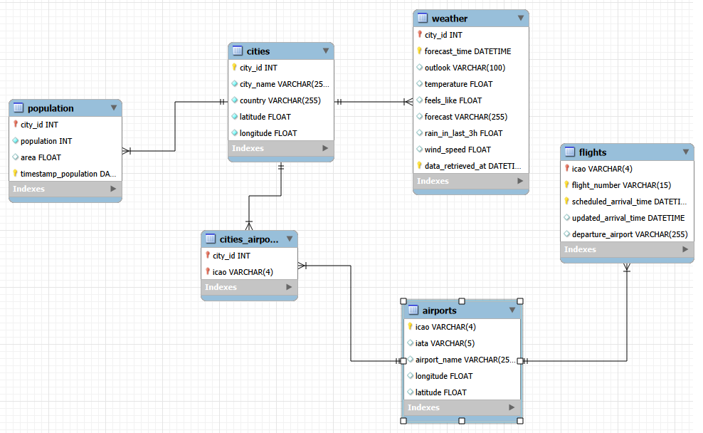

# 🚀 Multi-Source ETL Pipeline for GANS

## 🎯 Project Overview

This project demonstrates a multi-source ETL (Extract, Transform, Load) pipeline that integrates data from various external sources into a centralized relational database.

The pipeline collects data from cities, population statistics, weather APIs, airport information, and flight data, then processes and loads it into a MySQL database. The goal is to build a structured and connected dataset that can be used for analysis and reporting.

---

## 📊 Data Sources

This pipeline integrates multiple datasets to build a unified city-level database.

### 🏙️ City Data
- Source: Internal dataset
- Data Collected:
  - City names
  - Basic city metadata

### 👥 Population Data
- Source: Wikipedia
- Data Collected:
  - City population statistics

### 🌤️ Weather Data
- Source: OpenWeather API
- Data Collected:
  - Temperature
  - Weather conditions
  - Humidity
  - Wind speed

### ✈️ Airport Data
- Source: AeroDataBox API
- Data Collected:
  - Airport name and code
  - Geographic coordinates
  - Location details

### 🔗 Airport-City Mapping (cities_airport)
- Source: Derived dataset
- Data Collected:
  - Relationship between cities and airports
  - Foreign key mapping for relational joins

### 🛫 Flight Data
- Source: AeroDataBox API
- Data Collected:
  - Flight arrivals
  - Scheduled arrival times
  - Flight status (if available)

---

## 🚀 Key Features

- Extracts data from multiple sources (APIs and datasets)
- Performs data cleaning and transformation using Python
- Builds relational mappings between entities
- Loads structured data into a MySQL database
- Implements a complete end-to-end ETL workflow
- Supports scalable expansion for additional cities and data sources

---

## 🛠️ Technologies Used

### Programming
- Python

### Libraries
- pandas
- requests
- sqlalchemy
- pymysql
- beautifulsoup4

### Database
- MySQL

### Environment
- Jupyter Notebook

---

## 📁 Project Structure

```text
multi-source-etl-pipeline-for-gans/
│
├── 📂 SQL
│   └── Cities_db.sql
│
├── 📂 jupyter notebook
│   └── gans_final.ipynb
│
├── 📂 screenshot
│   └── database.png
│
├── .gitignore
└── README.md
```

---

## 📈 Database Schema

The following diagram illustrates the relational database design used in this project.



### Main Tables (in order of data flow)

- city
- population
- weather
- airport
- cities_airport
- flight

These tables are connected using relational keys to ensure proper data integration and efficient querying across different datasets.

---

## 🔗 Project Files

### 🗄️ SQL Script
- [Database Schema (SQL)](SQL/Cities_db.sql)

### 📓 Jupyter Notebook
- [ETL Pipeline Notebook](jupyter_notebook/gans_final.ipynb)

---

## 🔗 How to Use This Project

### 1. Clone the Repository

```bash
git clone https://github.com/your-username/multi-source-etl-pipeline-for-gans.git
```

### 2. Create the Database

Run the SQL script:

```text
SQL/Cities_db.sql
```

This will create all required tables in MySQL.

### 3. Run the ETL Pipeline

Open the Jupyter Notebook:

```text
jupyter notebook/gans_final.ipynb
```

Run all cells sequentially to execute the ETL pipeline.

---

### 4. Configure API Keys

Before running the notebook, ensure you add your API keys for:
- OpenWeather API
- AeroDataBox API

---

## 🚀 Future Improvements

- Automate pipeline execution using scheduling tools
- Deploy the ETL pipeline to a cloud platform
- Containerize the application using Docker
- Add data validation and error handling
- Extend support for additional cities and datasets

---
## 🎯 Conclusion

This project demonstrates a complete end-to-end ETL pipeline that integrates multiple real-world data sources into a structured relational database.

By combining city, population, weather, airport, and flight data, the system creates a unified dataset that can support deeper analysis and decision-making. The project highlights key data engineering concepts such as data extraction from APIs, transformation using Python, relational database design, and data loading into MySQL.

Overall, this pipeline serves as a strong foundation for scalable data integration systems and can be extended further with automation, cloud deployment, and real-time data processing capabilities.

---

## 📧 Contact

**Keertika Manikandan**

- GitHub: https://github.com/keertikamanikandan
- LinkedIn: https://linkedin.com/in/keertika-palaniappan
